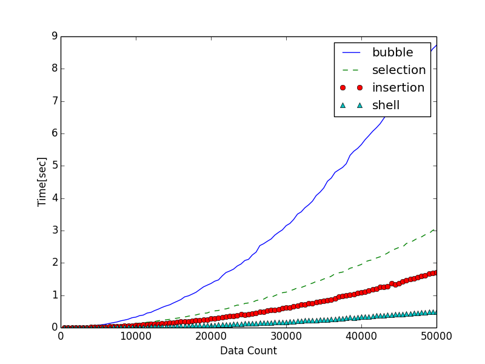

# BasicSortComparison
[プログラミングコンテンスト攻略のためのアルゴリズムとデータ構造](https://book.mynavi.jp/ec/products/detail/id=35408)
を参考にアルゴリズムの復習を進めているのですが、面白そうだったので大きなデータで基礎ソートの動作を比較してみました。

##Result
基礎ソートアルゴリズム

*バブルソート

*選択ソート

*挿入ソート

*シェルソート

を比較してみました。

結果は以下のようになりました。

##Usage

*〜Sort.cpp

各ソートアルゴリズムが入っています

*genRandomData.cpp

コマンドラインで指定した分の乱数を吐き出してtest.txtに保存します

*〜sort.sh

ソートを実行し、結果をresult_〜.txtにまとめます。500スタートで500刻み
50000個のデータまでソートするようにしています。

*plot.py

result〜.txtをpyplotでプロットします。

##考察
シェルソート以外はN二乗のオーダーのアルゴリズムと言われていますが、結構差がでるものですね。
バブルソートは、N!回必ずループが回って比較やらスワップやらとなるので、それだけ遅いイメージです。

選択ソートは毎回最小値を割り出して、ソート済みエリアに詰めていきます。これもループはN!回ループしますが、
スワップの回数がバブルソートより少ないのでその分速いイメージがあります。

挿入ソートはターゲットの要素をソート済みエリアの適切な位置に挿入していきますが、その時挿入する値より
大きいものを全部右にずらす処理が重い気がします。運がわるいとずらす要素が多くなって重くなりそうです。
そういう意味では整列され具合で動作速度に影響がありそうです。

シェルソートですが、よく整列されたデータに対しては高速に動作する挿入ソート特製を活かして、最初に
整列され具合を改善します。インターバルをきめて、複数回の挿入ソートをかけます。この例では4,3の
インターバルで前処理をして、最後に本番の選択ソート（インターバル1）を実施します。これだけNの1.25乗
のオーダーで動作するアルゴリズムだと言われているそうです。

今回はランダムな並びのデータに対して試しましたが、ほぼ逆順のデータや、ほぼ整列されたデータなどでも
試してみるとまた面白そうです。シェルソートのインターバルもバリエーションがありますのでいじってみると
面白そうな気がします。また勉強がすすんだらマージソートやクイックソートでもやってみようと思います。
